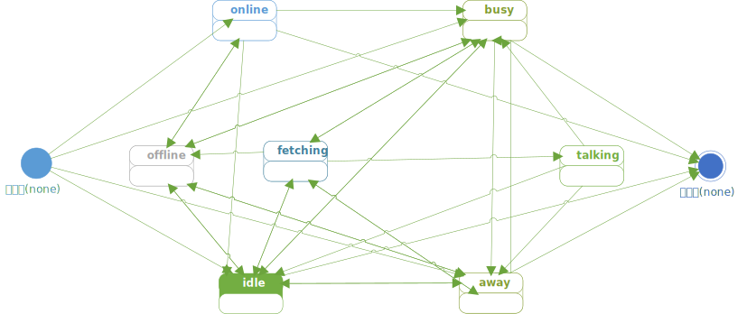

# 坐席管理接口
<!-- toc -->
[yunhuni]: http://yunhuni.com/

# 登录

## URL
```
POST {BASE_URL}/callcenter/agent/login
```

### 请求参数列表

参数                   | 有效值范围            | 必填 | 说明
---------------------- | ----------------------| ---- | ----------------------------------------
`id`                   | 字符/数字字符串       | √    | 该坐席的ID
`num`                  | 数字字符串            |      | 该坐席的工号，如果不填，且`id`是纯数字字符串，则与与之一致
`state`                | 状态字符串            |      | 登录后的初始状态
`skills`               | 技能数组              |      | 登陆后的初始技能

### `id` 参数
一个应用中的坐席`id`必须唯一

### `num` 参数
报工号时使用。如果指定了工号，他必须应用内唯一。

### `state` 参数
详见 _状态设置_ 一节。

### `skill` 参数
详见 _技能设置_ 一节。

# 注销

## URL
```
POST {BASE_URL}/callcenter/agent/logout
```

### 请求参数列表

参数                   | 有效值范围            | 必填 | 说明
---------------------- | ----------------------| ---- | ----------------------------------------
`id`                   | 字符/数字字符串       | √    | 该坐席的名称

# 报到
如果[云呼你平台][yunhuni]长时间收不到坐席的报到，就认为该坐席离线(`offine`)。

## URL
```
POST {BASE_URL}/callcenter/agent/touch
```

### 请求参数列表

参数                   | 有效值范围            | 必填 | 说明
---------------------- | ----------------------| ---- | ----------------------------------------
`id`                   | 字符/数字字符串       | √    | 该坐席的名称

# 获取坐席信息

## URL
```
POST {BASE_URL}/callcenter/agent/get
```

### 请求参数列表

参数                   | 有效值范围            | 必填 | 说明
---------------------- | ----------------------| ---- | ----------------------------------------
`id`                   | 字符/数字字符串       |      | 坐席的名称

如果不指定`id`则返回所有坐席的列表

单个的坐席对象形如:

```json
{
    "id": "1001",
    "num": "1001",
    "state": "away/饮水",
    "skills": [
        {"id": "投诉", "score": 80, "enabled": true},
        {"id": "联想笔记本", "score": 90, "enabled": true}
    ],
    "extensions": [
        {"id": "fj2m90cuildf", "active": true},
        {"id": "9MUGJoSDY9sd", "active": false}
    ]
}
```

# 分机设置

## URL
```
POST {BASE_URL}/callcenter/agent/setExtensions
```

### 请求参数列表

参数                   | 有效值范围            | 必填 | 说明
---------------------- | ----------------------| ---- | ----------------------------------------
`id`                   | 字符/数字字符串       | √    | 坐席的名称
`extensions`           | 分机列表              | √    | 分机

分机列表的元素是分机对象，其属性有：

属性名        |       数据类型       | 必填 |  说明
------------- | -------------------- | ---- | ---------------
`id`          | `String`             | √    | 分机的 Id
`active`      | `Boolean`            | √    | 分机是否激活

> - 坐席同一时间最多只能有一个激活的分机。 
> - 正在使用的分机不能修改所属坐席，或者从一个坐席删除。
> - 分机不能重复设置到多个不同的坐席。
> - 坐席至少要一个活动分机才能正常使用话务功能。

# 状态设置
用字符串表述坐席状态。

坐席状态包括基本状态和扩展状态，用类目录格式的字符串表示：

```
<基本状态>[/扩展状态]
```

如：

```
away/shitting
talking/complaint
busy/维修单录入
```

基本状态是固定的，它包括：

名称     | 可扩展 |说明
-------- | ------ |-----------------
none     |        | 正常注销，或者从未登录
offline  | √      | 离线（连接异常中断）
online   |        | 在线：已经登录，但是没有设置进一步的状态
idle     |        | 空闲
fetching | √      | 平台正在呼叫该坐席的分机
talking  | √      | 服务中（分机通话中）
busy     | √      | 忙碌
away     | √      | 离开

`busy`和`away`可扩展，扩展部分是满足POSIX文件路径规范的符串，不超过256长度。

- 坐席的状态变为 `talking/*`, `fetching/*`, `offline/*`, `none` 时无法通过API修改。
- 通过状态修改API只能将坐席状态修改为 `busy/*`, `away/*` 或者 `idle`。
- 坐席登录后，默认的初始状态是`online`，一旦其状态由`online`变为其它非离线状态，就不能再变成`online`。
- 只有处于`idle`状态的坐席才会被平台分配到排队任务。



## URL
```
POST {BASE_URL}/callcenter/agent/setState
```

### 请求参数列表

参数                   | 有效值范围            | 必填 | 说明
---------------------- | ----------------------| ---- | ----------------------------------------
`id`                   | 字符/数字字符串       | √    | 坐席的名称
`state`                | 状态字符串            | √    | 新的状态

# 技能设置

## URL
```
POST {BASE_URL}/callcenter/agent/setState
```

### 请求参数列表

参数                   | 有效值范围            | 必填 | 说明
---------------------- | ----------------------| ---- | ----------------------------------------
`id`                   | 字符/数字字符串       | √    | 坐席的名称
`skillOpts`            | 技能操作列表          | √    | 技能操作列表

#### `skillOpts` 参数
技能操作列表用于表示如何修改坐席的技能，该列表的元素是 `skillOpt` 技能操作对象，该对象的属性定义是：

属性名        |       数据类型       | 必填 |  说明
------------- | -------------------- | ---- | ---------------
`opt`         | `Integer`            | √    | 操作类型，`0`表示新增或者修改，`1`表示删除
`id`          | `String`             | √    | 要操作的技能。当 `opt==1` 时，`id`为空字符串表示删除所有技能。
`score`       | `Number`             |      | 坐席技能分。仅在 `opt==0` 时有效；如果坐席已经拥有该技能，不填表示不修改，否则分数为0。
`enabled`     | `Boolean`            |      | 坐席是否启用技能。仅在 `opt==0` 时有效；如果坐席已经拥有该技能，不填表示不修改，否则 `enabled==false`。

eg:
“投诉”技能分数调整为95，删除“洗衣机”技能

```js
skillOpts: [
    {opt: 0, id: "投诉", score: 95, enabled: true},
    {opt: 1, id: "洗衣机"},
]
```

eg:
删除所有技能

```js
skillOpts: [
    {opt: 1, id: ""}
]
```

eg:
禁用“投诉”技能

```js
skillOpts: [
    {opt: 0, id: "投诉", enabled: false}
]
```
