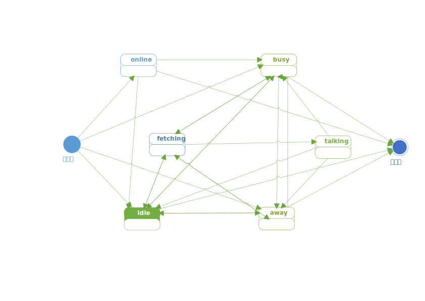

# 坐席管理接口
<!-- toc -->

# 登录

## URL
```
POST {BASE_URL}/callcenter/agent/login
```

### 请求参数列表

参数                   | 有效值范围            | 必填 | 说明
---------------------- | ----------------------| ---- | ----------------------------------------
`name`                 | 字符/数字字符串       | √    | 该坐席的名称
`num`                  | 数字字符串            |      | 该坐席的工号，如果不填，且`name`是纯数字字符串，则与与之一致
`dn`                   | 字符串                |      | 坐席的显示名
`state`                | 状态字符串            |      | 登录后的初始状态
`skills`               | 技能数组              |      | 登陆后的初始技能

### `name` 参数
一个应用中的坐席`name`必须唯一

### `num` 参数
报工号时使用。如果指定了工号，他必须应用内唯一。

### `state` 参数
详见状态修改API一节。


# 注销

# 报到

# 技能设置

# 状态设置
坐席状态(`state`)：用字符串记录坐席状态。

坐席状态包括基本状态和扩展状态，本文中用类目录格式的字符串表示为：

```
<基本状态>[/扩展状态]
```

如：

```
away/shitting
talking/complaint
busy/维修单录入
```

基本状态是固定的，它包括：

名称     | 可扩展 |说明
-------- | ------ |-----------------
none     |        | 正常注销，或者从未登录
offline  | √      | 离线（连接异常中断）
online   |        | 在线：已经登录，但是没有设置进一步的状态
idle     |        | 空闲
fetching | √      | 平台正在呼叫该坐席的分机
talking  | √      | 服务中（分机通话中）
busy     | √      | 忙碌
away     | √      | 离开

`busy`和`away`可扩展，扩展部分是满足POSIX文件路径规范的符串，不超过256长度。

- 坐席的状态变为 `talking/*`, `fetching/*`, `offline/*`, `none` 时无法通过API修改。
- 通过状态修改API只能将坐席状态修改为 `busy/*`, `away/*` 或者 `idle`。
- 坐席登录后，默认的初始状态是`online`，一旦其状态由`online`变为其它非离线状态，就不能再变成`online`。
- 只有处于`idle`状态的坐席才会被平台分配到排队任务。


