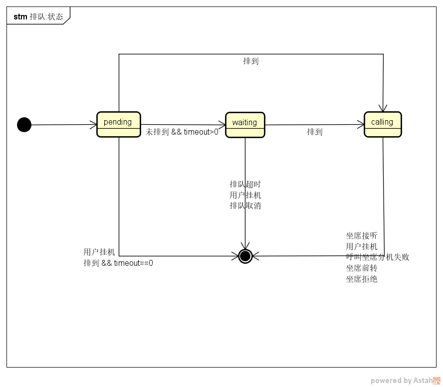

# ACD 排队事件
<!-- toc -->

## 排队选中坐席
排队任务选中了坐席，开始呼叫这个坐席的分机。

参数                      | 有效值范围                          | 说明
----------------------    | ----------------------------------- | ----------------------------------------
`event`                   | **callcenter.queue.select**         | 据此字段识别不同事件
`id`                      | ID                                  | 排队任务的ID
`type`                    | 字符串                              | 排队类型（见 [`type` 参数定义](#type)）
`channel_id`              | ID                                  | 排队通道ID（见 [工作通道](../acd/channel.md)）
`condition_id`            | ID                                  | 选中的条件（如果指定Agent，则该参数为空）
`agent_name`              | 坐席名称                            | 选中的坐席
`origin_call_id`          | ID                                  | 在IVR引发的排队中，此属性记录IVR呼叫的`ID`。API引发的排队中，此参数为空
`agent_extension_id`      | ID                                  | 坐席分机ID
`agent_call_id`           | ID                                  | 呼叫坐席分机的呼叫ID
`data`                    | 字符串                              | 用户数据

### `type`
排队类型

值              | 说明
--------------- | --------------
`ivr`           | IVR 引发的排队
`call_agent`    | 呼叫坐席API引发的排队
`fwd_agent`     | 前传到坐席API引发的排队
`xfer_agent`    | 后传到坐席API引发的排队
`invite_agent`  | 邀请坐席API引发的排队

## 排队成功
排队任务选中了坐席，且成功的与这个坐席的分机建立通话。

参数                      | 有效值范围                          | 说明
----------------------    | ----------------------------------- | ----------------------------------------
`event`                   | **callcenter.queue.success**        | 据此字段识别不同事件
`id`                      | ID                                  | 排队任务的ID
`type`                    | 字符串                              | 排队类型（见 [`type` 参数定义](#type)）
`channel_id`              | ID                                  | 排队通道ID（见 [工作通道](../acd/channel.md)）
`condition_id`            | ID                                  | 选中的条件（如果指定Agent，则该参数为空）
`agent_name`              | 坐席名称                            | 选中的坐席
`origin_call_id`          | ID                                  | 在IVR引发的排队中，此属性记录IVR呼叫的`ID`。API引发的排队中，此参数为空
`agent_extension_id`      | ID                                  | 坐席分机ID
`agent_call_id`           | ID                                  | 呼叫坐席分机的呼叫ID
`data`                    | 字符串                              | 用户数据

## 排队失败
排队任务未选中坐席，或者在选中坐席后未成功的与这个坐席的分机建立通话。

参数                      | 有效值范围                          | 说明
----------------------    | ----------------------------------- | ----------------------------------------
`event`                   | **callcenter.queue.fail**           | 据此字段识别不同事件
`id`                      | ID                                  | 排队任务的ID
`type`                    | 字符串                              | 排队类型（见 [`type` 参数定义](#type)）
`channel_id`              | ID                                  | 排队通道ID（见 [工作通道](../acd/channel.md)）
`condition_id`            | ID                                  | 选中的条件（如果指定Agent，则该参数为空）
`agent_name`              | 坐席名称                            | 选中的坐席
`cause`                   | 字符串                              | 排队失败原因
`origin_call_id`          | ID                                  | 在IVR引发的排队中，此属性记录IVR呼叫的`ID`。API引发的排队中，此参数为空
`agent_extension_id`      | ID                                  | 坐席分机ID（如果没有排到坐席，则为空）
`agent_call_id`           | ID                                  | 呼叫坐席分机的呼叫ID（如果没有排到坐席，则为空）
`data`                    | 字符串                              | 用户数据

### `cause`
排队失败原因

值                     | 说明
---------------------- | --------------
`timeout`              | 排队超时
`hangup`               | 排队或者呼叫坐席期间排队发起方的呼叫挂断
`cancel`               | 排队或者呼叫坐席期间调用API取消排队
`call_fail`            | 呼叫坐席分机失败
`forward`              | 排队被前传
